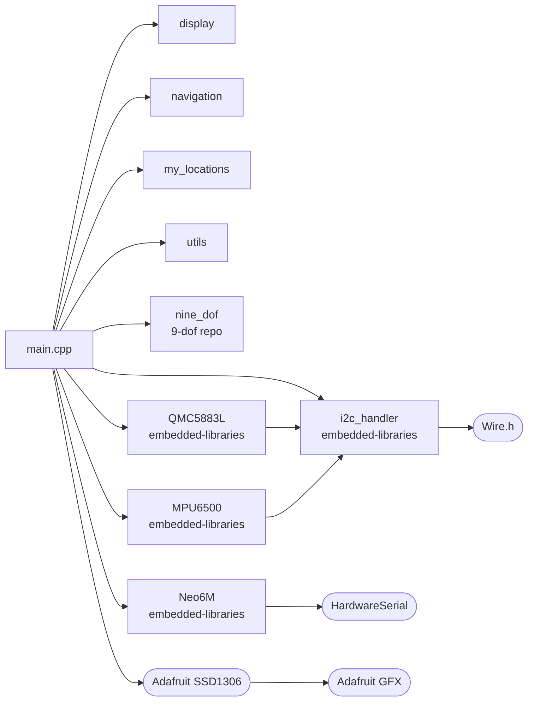

# Beer Compass

A compass built with the Arduino framework that always points to the nearest
liquor store. This repository contains the firmware for version 0 of the
project, which uses breakout boards and breadboards. Version 1 will feature a
custom PCB design, but the firmware will remain largely the same since the same
ICs will be used.

## Repository layout

This project is part of a small embedded monorepo ecosystem. Two sibling
repositories must be cloned alongside this one:

```
Projects/
├── embedded-libraries/   Hardware drivers (QMC5883L, MPU6500, Neo6M, i2c_handler)
├── 9-dof/                Sensor fusion algorithms (pitch, roll, yaw, tilt-compensated heading)
└── beer-compass-v0/      ← this repo — application logic only
```

`platformio.ini` points at both sibling repos via `lib_extra_dirs`. Clone all
three into the same parent directory and `pio run` will resolve every dependency
automatically.

## Getting started

```bash
# Clone all three repos side by side
git clone <url>/embedded-libraries
git clone <url>/9-dof
git clone <url>/beer-compass-v0

cd beer-compass-v0
pio run
```

## Project architecture

The codebase is split into three responsibility layers:

| Layer | Where it lives |
|---|---|
| Hardware drivers — register maps, I2C/UART comms, raw data conversion | `embedded-libraries` repo |
| Sensor fusion — pitch, roll, yaw, tilt-compensated azimuth | `9-dof` repo |
| Application — UI, navigation, locations, sensor wiring | this repo (`src/`, `include/`) |

### Dependency graph



**Shape legend**
- Rectangle — portable logic library (minimal changes when changing targets)
- Rounded rectangle / pill — platform wrapper (requires modification when changing frameworks)

## Hardware

| Component | Interface | Notes |
|---|---|---|
| ESP32 DevKit V1 | — | MCU |
| QMC5883L | I2C (SDA 21, SCL 22) | Magnetometer |
| MPU6500 | I2C (SDA 21, SCL 22) | Accelerometer / gyroscope |
| u-blox NEO-6M | UART (RX 16, TX 17) | GPS |
| SSD1306 128×64 OLED | I2C (SDA 21, SCL 22) | Display |
